# 钱迹自动记账 parser 静态分析报告

> 分析日期：2026-09-27
> 样本：钱迹 4.5.3b7（来自本地既有解包产物）
> 分析类型：APK 静态代码路径分析
> 工具状态：使用已有 JADX/apktool 输出；工具索引显示本机 jadx、apktool CLI 不可用
> 详细实现规格：[PARSER_SPEC.md](../.agent/qianji_parser_audit/PARSER_SPEC.md)

## 1. 执行摘要

**实现复核更正**：56 是 profile 注册并映射到 parser 的 pageType 数，不保证 56 页均能独立命中。美团 `aa/d.java` 把券详情注册在团购详情之前；`w9/e.java` 的团购识别条件完全包含 `w9/i.java` 的券识别条件，因此首个匹配会把典型团购页面识别为券详情。美团真实注册顺序中的充电宝、单车、支付成功、钱包、外卖也已在实现规格中按 `aa/d.java` 校正。

本次沿钱迹 4.5.3b7 的 profile 注册、页面识别、parser 映射和候选构造路径审计了用户关心的自动记账逻辑。静态代码中存在七个有效 App profile，共有 56 个已注册页面 parser 映射；“七条 parser”更准确地说是七组 App 解析器，每组覆盖多个 pageType。钱迹先读取无障碍页面，再展示可编辑候选由用户确认；它不是检测到页面就直接写账。钱迹的部分默认值和状态处理有误记风险：缺省交易类型 raw 0 在其 UI 显示为支出，PDD 与抖音解析器均未显式设置类型，且若干 parser 匹配待收款/待支付/退款状态但未证明方向及结算语义。此次仅完成静态审计和实现规格，未修改本项目产品代码；动态页面结构和真实识别率仍未知。

## 2. 范围与授权

授权与边界记录见 [scope.md](../.agent/qianji_parser_audit/scope.md)。分析仅针对用户指定的本地报告及已有反编译输出，没有运行 APK、连接网络、登录、Hook 或修改产品源码。时间记录见 [timeline.md](../.agent/qianji_parser_audit/timeline.md)。

## 3. 分发与调用路径

```mermaid
flowchart LR
  event[AccessibilityEvent] --> gate[包名 profile gate]
  gate --> filter[profile event/activity filter]
  filter --> tree[有序无障碍节点树]
  tree --> recognize[按注册顺序识别首个 pageType]
  recognize --> registry[pageType 到专用 parser]
  registry --> fields[字段规则与页面后处理]
  fields --> candidate[BillInfo 候选]
  candidate --> dedup[候选去重]
  dedup --> edit[可编辑浮层]
  edit --> user[用户确认保存]
```



七个有效 profile 为微信、支付宝、拼多多、云闪付、京东、美团、抖音；按 profile 分别有 12、16、3、5、6、10、4 个已注册 pageType→parser 项，总计 56。微信密码确认页有 recognizer 但无 parser；美团跑腿详情只有常量未接入；注册表中的两个淘宝 parser 没有本版本 profile gate。

## 4. Evidence（观察）

| ID | source_ref | repro_command | content_hash | 观察 |
|---|---|---|---|---|
| E-001 | `../../_dl/qianji_453b7_1229_beta/jadx/sources/s9/b.java:17-78`；`../../_dl/qianji_453b7_1229_beta/jadx/sources/i9/d.java:18-81` | `Get-Content -LiteralPath '../_dl/qianji_453b7_1229_beta/jadx/sources/s9/b.java'`；`Get-Content -LiteralPath '../_dl/qianji_453b7_1229_beta/jadx/sources/i9/d.java'`（在 repo 根目录执行） | n/a | profile 层按包名注册并分发；pageType registry 中可见各 App parser 对应关系。 |
| E-002 | `../../_dl/qianji_453b7_1229_beta/jadx/sources/i9/b.java:40-115`；`../../_dl/qianji_453b7_1229_beta/jadx/sources/com/mutangtech/qianji/data/model/Bill.java:582-592`；`../../_dl/qianji_453b7_1229_beta/jadx/sources/com/mutangtech/qianji/auto/floatview/AutoBillFloatingView.java:1563-1592` | `rg -n -A 12 'isAllIncome|isAllSpend|isAllTransfer' '../_dl/qianji_453b7_1229_beta/jadx/sources/com/mutangtech/qianji/data/model/Bill.java'`；`Get-Content -LiteralPath '../_dl/qianji_453b7_1229_beta/jadx/sources/com/mutangtech/qianji/auto/floatview/AutoBillFloatingView.java' | Select-Object -Skip 1562 -First 31`（在 repo 根目录执行） | n/a | 共用层设置缺省 raw billType=0、绝对值金额；下游定义收入/支出/转账 raw 类型，并将候选切到相应编辑页。 |
| E-003 | `../.agent/qianji_parser_audit/notes/wechat_alipay.md`、`../.agent/qianji_parser_audit/notes/pdd_douyin_shared.md`、`../.agent/qianji_parser_audit/notes/jd_meituan_unionpay.md`；对应 recognizer/parser 类见各笔记行号 | `Get-Content -LiteralPath '.agent/qianji_parser_audit/notes/pdd_douyin_shared.md'`；同理读取另两份逐页审计笔记（在 repo 根目录执行） | n/a | 逐页门槛、字段提取与状态边界已有独立记录；PDD/Douyin matcher 和指定疑点用 smali 交叉检查。 |
| E-004 | `../../_dl/qianji_453b7_1229_beta/jadx/sources/l9/f.java`、`l9/g.java`、`n9/a.java`、`i9/b.java:93-115`；微信/支付宝 parser 笔记 | `Get-Content -LiteralPath '../_dl/qianji_453b7_1229_beta/jadx/sources/l9/f.java'`；读取 `l9/g.java`、`n9/a.java` 与 `i9/b.java`（在 repo 根目录执行） | n/a | 静态继承链显示京东钱包 parser 来源名可能沿用 PDD 父类；提现 parser 的 `fee` 与公共 builder 读取的 `feeAmount` 不一致。 |
| E-005 | `../.agent/qianji_apk_analysis/REPORT.md` 与 `../.agent/qianji_parser_audit/notes/core_architecture.md` | `Get-Content -LiteralPath '.agent/qianji_apk_analysis/REPORT.md'`；`Get-Content -LiteralPath '.agent/qianji_parser_audit/notes/core_architecture.md'`（在 repo 根目录执行） | n/a | 候选先进入去重与可编辑浮层，再由用户确认保存；不是 parser 直接落账。 |

以上 Evidence 描述的是本地反编译代码观察，不证明目标 App 当前页面、动态运行结果或账务正确性。

## 5. Findings（分析结论）

### F-001：七个 App profile 实际展开为 56 个页面 parser

- **severity**: n/a_re
- **category**: reverse_algo
- **status**: candidate（静态确认；运行时可达性未在设备验证）
- **evidence_ids**: E-001、E-003
- **location**: `s9/b.java`、`i9/d.java`、各 App `aa/*` recognizer 与 parser 类
- **confidence**: high（仅限代码注册关系）
- **impact**: 若只写七个宽泛 parser，将缺少钱迹按 pageType 单独设置的识别条件和字段来源。
- **repro_steps**: 阅读 profile gate 与 parser registry，再核对三份逐 App 明细的可达性清单。
- **remediation**: 实现七个 profile 和 56 个页面级规则；对无 profile gate 或无 parser 页面明确不计入支持。

### F-002：钱迹默认类型并非“未知”；raw 0 实际按支出呈现

- **severity**: n/a_re
- **category**: reverse_algo
- **status**: candidate（静态代码路径）
- **evidence_ids**: E-002、E-003
- **location**: `i9/b.java:93-115`、`Bill.java:582-592`、`AutoBillFloatingView.java:1563-1592`
- **confidence**: high（编辑器映射静态可见）
- **impact**: 页面解析器没有显式类型时，共享层填 0 并进入支出页；PDD 和抖音共 7 个 parser 均存在此默认行为。抖音收款等页面不应直接复制该类型。
- **repro_steps**: 查看公共 builder 默认值、Bill 类型谓词和自动记账编辑页选择逻辑。
- **remediation**: 本项目用显式 `EXPENSE/INCOME/TRANSFER/UNKNOWN` 与状态字段；方向证据不足时不默认支出。

### F-003：部分识别门槛覆盖未完成或退款页面，状态不等于已结算

- **severity**: n/a_re
- **category**: design
- **status**: candidate（静态门槛已见，动态业务语义待真实样本）
- **evidence_ids**: E-003
- **location**: PDD 先用后付、Douyin waiting、Alipay bill detail、Meituan voucher/delivery 与退款页 parser；明细见逐页笔记
- **confidence**: medium
- **impact**: 直接照抄 pageType 命中逻辑可能把待付款、待收款、待到店使用或预计送达当成完成交易；退款可能缺方向、金额净额或原账单关联。
- **repro_steps**: 按 E-003 指向的节点条件检查 recognizer 和 parser 是否输出显式状态、方向及退款关联。
- **remediation**: 将 `transactionStatus` 与账本方向分开解析；仅在状态与金额语义明确后产生确定候选。

### F-004：部分 parser 存在来源与手续费字段错配

- **severity**: n/a_re
- **category**: other
- **status**: candidate（静态缺陷迹象，未运行验证）
- **evidence_ids**: E-004
- **location**: `l9/f.java`、`l9/g.java`、`n9/a.java`、`i9/b.java:109-115`；微信与支付宝提现 parser 见逐页笔记
- **confidence**: medium
- **impact**: 钱迹京东钱包候选的 sourceApp 可能标成 PDD；提现手续费使用 `fee` 键而 builder 只读 `feeAmount`，沿共用路径可能丢失手续费。
- **repro_steps**: 检查继承的 source getter、builder 调用 getter 的位置以及 fee map key 与读取 key。
- **remediation**: 本项目始终从包名 profile 设置来源；统一手续费字段模型并加 parser fixture 覆盖。

## 6. Path（关键调用/数据流）

### P-001：无障碍页面到人工确认候选

- **path_type**: callflow
- **start**: AccessibilityEvent
- **goal**: 用户在确认浮层中保存账单
- **steps**:
  1. 事件包名查 profile，再执行该 profile 的事件筛选 — evidence: E-001 — finding: F-001
  2. 从当前窗口节点识别首个 pageType，再从 registry 取专用 parser — evidence: E-001、E-003 — finding: F-001
  3. parser 填字段，共用层补默认值并构建 BillInfo — evidence: E-002、E-003 — finding: F-002
  4. 候选去重后展示可编辑浮层，用户确认保存 — evidence: E-005 — finding: none
- **residual_risks**: 代码未动态执行；实时节点、系统版本/OEM 差异、识别准确度、重复事件和退款语义仍未验证。

## 7. 静态复核结论与实施建议

逐页 matcher、字段回退、parser 后处理和证据行号见 [完整规格](../.agent/qianji_parser_audit/PARSER_SPEC.md) 及其三份 App 组审计笔记。与你指出的现状一致，本项目还没有钱迹式按 `pageType` 识别并分发到专用 parser 的完整页面解析体系；仓库虽有无障碍服务、候选模型、确认覆盖层和少量专项/泛化解析类，但不覆盖这次要复刻的 56 个页面规则。建议沿现有 Kotlin 路径加入 profile gate、ordered page recognizer 和页面级 parser，不重写确认/保存流程。

实施时不复制钱迹的零金额/默认支出兜底、待处理页面语义、PDD 来源错标或 fee key 错配。建议为 56 个已注册映射准备可回放正例与相似负例；退款、待收款、先用后付、待到店使用及支付时间需要真实页面样本确定语义。

## 8. 复现方式

在项目根目录可用 PowerShell 阅读已有反编译源码与审计笔记：

```powershell
Get-Content -LiteralPath '../_dl/qianji_453b7_1229_beta/jadx/sources/s9/b.java'
Get-Content -LiteralPath '../_dl/qianji_453b7_1229_beta/jadx/sources/i9/d.java'
Get-Content -LiteralPath '.agent/qianji_parser_audit/PARSER_SPEC.md'
```

此次没有执行 APK、测试、构建、联网或 Hook；没有生成运行时截图。主机当前缺少 jadx/apktool 命令行工具，复核依赖任务开始前已存在的反编译文本。

## 9. 遗留问题

- 实际使用中的微信/支付宝/拼多多/云闪付/京东/美团/抖音版本与节点树布局未验证。
- PDD/Douyin 所有页面缺省支出行为是否钱迹预期不明；不应依据静态默认值认定业务方向。
- 退款、部分退款、待确认收款和转账完成条件需用非敏感真实页面样本确认。
- 钱迹日期解析器对纯日期文本的处理还需针对 smali 与 fixture 验证。
- 钱迹静态报告指出 JADX 有 42 个反编译错误；关键疑点不代表每个 parser 都经 smali 逐指令验证。

## 10. 附录

- Scope：[scope.md](../.agent/qianji_parser_audit/scope.md)
- Timeline：[timeline.md](../.agent/qianji_parser_audit/timeline.md)
- 实现规格：[PARSER_SPEC.md](../.agent/qianji_parser_audit/PARSER_SPEC.md)
- 三组逐页审计：[微信/支付宝](../.agent/qianji_parser_audit/notes/wechat_alipay.md)、[拼多多/抖音](../.agent/qianji_parser_audit/notes/pdd_douyin_shared.md)、[云闪付/京东/美团](../.agent/qianji_parser_audit/notes/jd_meituan_unionpay.md)
